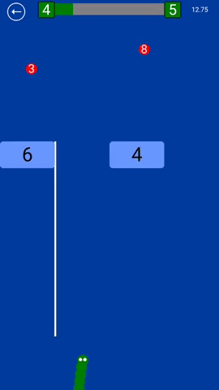
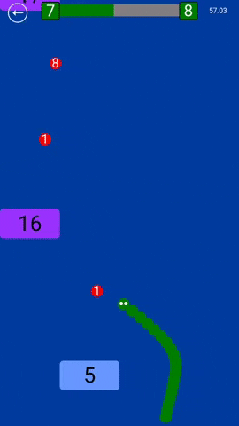
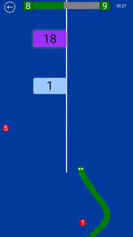
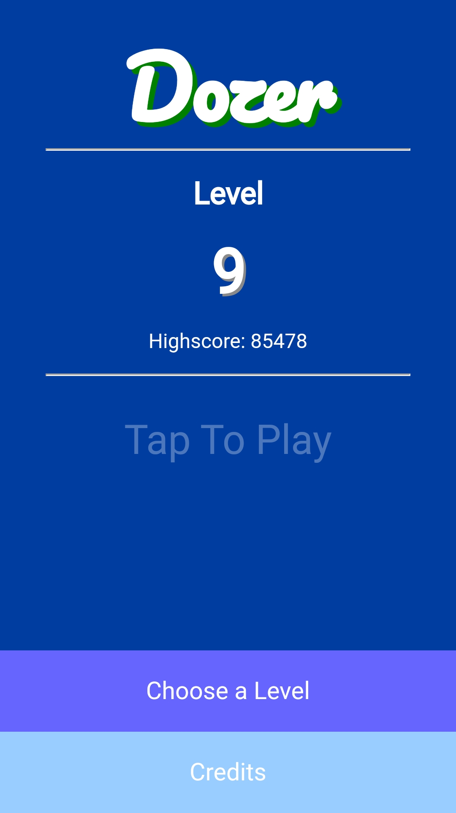
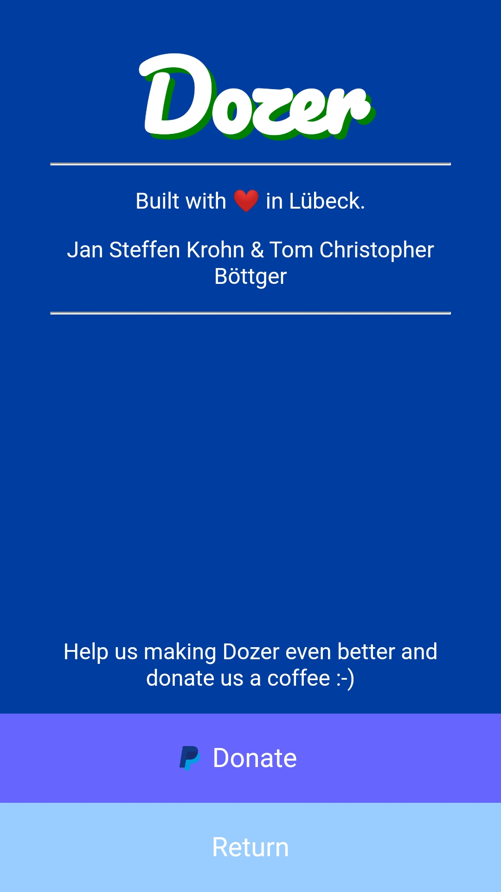

# Dozer - The Game
#### _Web Technology Project at the Technical University of Applied Sciences Lübeck - Summer Semester 2019_
#### _Team 4A Dozer_

```dart
List<String> authors = new List(2);
authors.add("Jan Steffen Krohn");
authors.add("Tom Christopher Boettger");
```

The game was developed entirely with dart, without using any external libraries or frameworks. The goal was to understand the principles of web technologies and to be able to apply them correctly. During our development we gathered statistical data to improve the levels, which has been removed in the final version. Scroll down for impressions. :blush:

Game URL: https://steffenkrohn.github.io/Dozer/ ([Alternative Link](https://webtech.mylab.th-luebeck.de/hall-of-fame/ss2019/dozer/))

API Docs: https://steffenkrohn.github.io/Dozer/doc/

Wiki: https://github.com/SteffenKrohn/Dozer/blob/master/documentation/Home.md

Hall of Fame: https://webtech.mylab.th-luebeck.de/hall-of-fame/

## Let Me Play
**Scan the QR Code and start playing on your smartphone** :raised_hands:

The fullscreen mode works best on android paired with chrome. After you've opened the app, you can also add the web app to your home screen from your browser's menu. :wink:


## Screenshots
<p float="left">



</p>

#### 
<p float="left">


</p>
