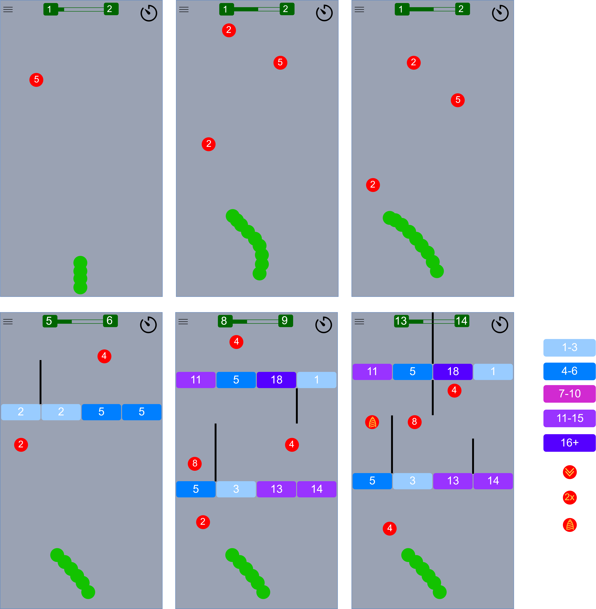
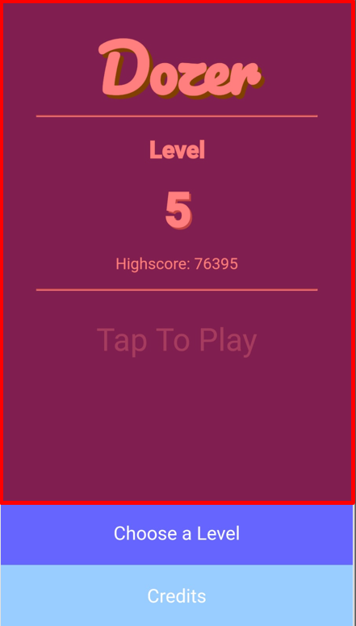
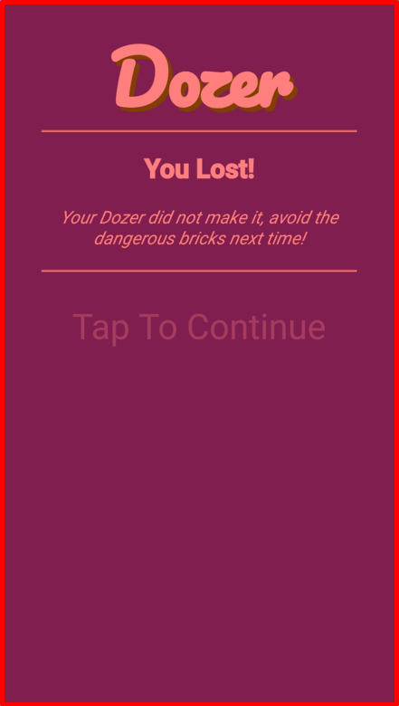
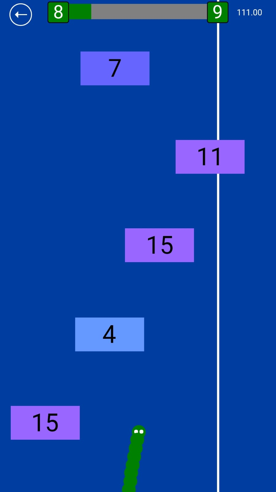

# Dozer - Documentation
#### _Web Technology Project at The University of Applied Sciences Lübeck - Summer Term 2019_
  
```dart
List<String> authors = new List(2);
authors.add("Jan Steffen Krohn");
authors.add("Tom Christopher Boettger");
```

Game URL: https://steffenkrohn.github.io/Dozer/ ([Alternative Link](https://webtech.mylab.th-luebeck.de/hall-of-fame/ss2019/dozer/))

API Docs: https://steffenkrohn.github.io/Dozer/doc/

Hall of Fame: https://webtech.mylab.th-luebeck.de/hall-of-fame/

# Outline
**[1 Introduction](#1-introduction)**  
**[2 Requirements and Game Concept](#2-requirements-and-game-concept)**  
**[3 Organization of Work](#3-organization-of-work)**  
**[4 Architecture and Implementation](#4-architecture-and-implementation)**  
&nbsp;&nbsp;&nbsp; [4.1 Model](#41-model)  
&nbsp;&nbsp;&nbsp;&nbsp;&nbsp;&nbsp; [4.1.1 Level](#411-level)  
&nbsp;&nbsp;&nbsp;&nbsp;&nbsp;&nbsp; [4.1.2 Entities](#412-entities)  
&nbsp;&nbsp;&nbsp;&nbsp;&nbsp;&nbsp;&nbsp;&nbsp;&nbsp;&nbsp;&nbsp; [4.1.2.1 Dozer](#4121-dozer)  
&nbsp;&nbsp;&nbsp;&nbsp;&nbsp;&nbsp;&nbsp;&nbsp;&nbsp;&nbsp;&nbsp; [4.1.2.2 Dot](#4122-dot)  
&nbsp;&nbsp;&nbsp;&nbsp;&nbsp;&nbsp;&nbsp;&nbsp;&nbsp;&nbsp;&nbsp; [4.1.2.3 Brick](#4123-brick)  
&nbsp;&nbsp;&nbsp;&nbsp;&nbsp;&nbsp;&nbsp;&nbsp;&nbsp;&nbsp;&nbsp; [4.1.2.4 Power Ups](#4124-power-ups)  
&nbsp;&nbsp;&nbsp;&nbsp;&nbsp;&nbsp; [4.1.3 Collision Checker](#413-collision-checker)  
&nbsp;&nbsp;&nbsp; [4.2 View](#42-view)  
&nbsp;&nbsp;&nbsp;&nbsp;&nbsp;&nbsp; [4.2.1 Menu View](#421-menu-view)  
&nbsp;&nbsp;&nbsp;&nbsp;&nbsp;&nbsp; [4.2.2 Level View](#422-level-view)  
&nbsp;&nbsp;&nbsp; [4.3 Controller](#43-controller)  
&nbsp;&nbsp;&nbsp;&nbsp;&nbsp;&nbsp; [4.3.1 App Controller](#431-app-controller)  
&nbsp;&nbsp;&nbsp;&nbsp;&nbsp;&nbsp; [4.3.2 Level Controller](#432-level-controller)  
&nbsp;&nbsp;&nbsp; [4.4 File](#44-file)  
**[5 Concept of Levels and Parameterization](#5-concept-of-levels-and-parameterization)**  
&nbsp;&nbsp;&nbsp; [5.1 Level Concept](#51-level-concept)  
&nbsp;&nbsp;&nbsp; [5.2 Parameterization Concept](#52-parameterization-concept)  
**[6 Level Generator](#7-level-generator)**  
&nbsp;&nbsp;&nbsp; [6.1 Level Generator Tools](#61-level-generator-tools)  
&nbsp;&nbsp;&nbsp; [6.2 Level Generator Models](#62-level-generator-models)  
&nbsp;&nbsp;&nbsp; [6.3 Level Generator Sets](#63-level-generator-sets)  
**[7 Requirements Verification](#6-requirements-verification)**  
&nbsp;&nbsp;&nbsp; [7.1 Verification of the Functional Requirements](#71-verification-of-the-functional-requirements)  
&nbsp;&nbsp;&nbsp; [7.2 Verification of the Documentary Requirements](#72-verification-of-the-documentary-requirements)  
&nbsp;&nbsp;&nbsp; [7.3 Verification of the Compliance to Technical Constraints](#73-verification-of-the-compliance-to-technical-constraints)  
&nbsp;&nbsp;&nbsp; [7.4 Responsibilities of Team Members in the Project](#74-responsibilities-of-team-members-in-the-project)  

# List of Figures
- [Figure 1: Summarizing the game concept visually](#2-requirements-and-game-concept)
- [Figure 2: Architecture described by reference to the libraries](#4-architecture-and-implementation)
- [Figure 3 and 4: Red area shows the tappable area that leads to starting or restarting a level](#421-menu-view)
- [Figure 5: Menu Bar inside an active level](#422-level-view)
- [Figure 6: View of a running level](#422-level-view)

# List of Tables
- [Verification of the Functional Requirements](#71-verification-of-the-functional-requirements)
- [Verification of the Documentary Requirements](#72-verification-of-the-documentary-requirements)
- [Verification of the Compliance to Technical Constraints](#73-verification-of-the-compliance-to-technical-constraints)

# Program Listings
- [Listing 1: AppController's constants and variables](#431-app-controller)
- [Listing 2: Generic example for showing a certain view and create button listeners](#431-app-controller)
- [Listing 3: Factory method of the LevelController](#432-level-controller)
- [Listing 4: Listeners for controlling the Dozer](#432-level-controller)

# 1 Introduction

_"Computer Games are the pinnacle when it comes to (programming) fun."_ This quote might already been true for a lot of
students and they were delighted when they heard about the web technology project in the fourth semester. This did not
happen for us - at least not right at the beginning. Maybe just because we are non gamers, but also because we thought
there were more interesting things you could build as an online service. But when the project started and the teams were
built, things went quickly. The competition between the teams and the fast results you can achieve with web technologies
are amazing to get hyped more and more.

The goal with this project was, and still is, to build a nice and enjoyable single player game with the main focus on
mobile devices and the motion control. To classify the things outlined in this documentation, it is helpful to have played the game at least until level four. Why level four? Just because then you have seen
most of the game entities we use. Our purpose with the first levels is to give the player a progressive introduction to
the game concept and it's components. [Click here for the QR-Code!](QR-Code.md)

# 2 Requirements and Game Concept

The module web technology itself prescribes specific requirements for the web browser based game. The basic specification
is that the game should be served as a static and single page, so it could be served by any web server or Content
Delivery Network. The architecture should follow the Model-View-Controller pattern and it is important that all visible
elements and the dynamic content should only rely on DOM-Tree manipulations. The target platforms are mobile devices or
smartphones respectively so it is possible to use the gyroscopic sensor, which is also mandatory to use in the game concept.
Regarding the control of the game elements it is specified that for instance controlling the main character must work with
motion control. Even if desktop web browsers are not the game's main target it should work and be playable on them as
well - lowered quality in some aspects is acceptable.

Strict constraints are made regarding the used technologies. Dart must be used as client side language and
libraries other than the core ones should be omitted. Furthermore there should not be any gimmicks regarding sounds,
videos or other technical stuff like the use of the camera. Of course a good game needs a highscore which the user wants
to be kept over sessions. For that purpose only client side technologies like the local storage should be used and not
a central server with the use of cookies or a database.

The aim is to build a game concept which is simple and intuitive and fits to the requirement of motion control.
Yet it still should be complex enough to meet the technical requirements. And obviously it should be fun to play.
To ensure that the player has fun over a long time the game concept should also include a level concept, which means 
a format in which levels are declared in their own files (e.g. JSON format) so levels can be added later easily. The level difficulty must increase.

We considered all these requirements in our game concept. The initial idea came up when we thought about the motion
control and we thought that the snake game could be easily transformed to meet the motion control requirement. Of course
just the snake game would be very boring after a time and to be honest not complex enough. So we enhanced the idea into
something more - something more creative with more elements. To give a better overview of the whole concept the main
points are listed below:

- There is no static field but a moving lane which is moving constantly from the top to the bottom
- The lane has a level-specific speed and length
- Main character of the game is the so called Dozer
- On the lane, 'Dots' are spread and those Dots have a defined value
- The Dozer follows the same principle as the original snake since it grows when catching a Dot
- While the lane and all its content moves constantly downwards, the Dozer stays on the screen, resulting in the Dozer always moving upwards relative to the other level elements.
- With that principle it is possible for the Dozer to catch Dots

To make it more exciting we thought of several other features like:
- Bricks which have a specific value and decrease the Dozer´s score and length respectively when hitting them
- Barriers which stop the Dozer in the horizontal direction if the Dozer hits them
- Power Up's to give more variability
  - Drill, which gives the Dozer invulnerability to not lose any length or score when hitting the dangerous bricks
  - Slow Down, which slows down the speed at which the other elements move downwards and make it easier to catch dots and to avoid the bricks
  - Double Up, which doubles all the caught Dot's values

As mentioned, the game has a moving lane, which has a specific speed and length. Therefore one level has a time
limit. The players job is to increase the Dozer's length. The player can win a level if he reaches the level specific
'target length' or 'target score' (we use both words equivalent) without exceeding the time limit. Otherwise there are
two ways to lose a level. Option one is if the Dozer hits too high valued or too many bricks and the length
decreases to less than one. Option two of loosing is if the time limit is reached without having the required score.  
Another idea is to grow the Dozer right on the screen so with a higher length the difficulty increases because the Dozer´s head is places higher up on the screen. So the player has less time to react and decide the higher the score is.

  
_Figure 1: Summarizing the game concept visually_

Regarding the control of the Dozer we thought of two implementations. One for mobile devices and one for desktop
devices. On smartphones it should be possible to control the Dozer by tilting the phone. By tilting it to the right the
Dozer moves to the right and vice versa. Even though desktop devices are not the main target platform, controlling the
Dozer with the left, right and upper arrow keys should be possible. The upper arrow key is only used to stop the Dozer´s horizontal movement.

A very important requirement regarding the architecture is that we focus on extensibility.
New game elements should be easy to implement with specific rules which are given by the use of a hierarchical class structure with inheritance.
Ideas for those extensions are moving Bricks, expanding or shrinking elements or even complete new elements with new look and functionality like a power up for letting the Dozer jump over a Brick by collecting a special Dot and then pulling up the smartphone.


# 3 Organization of Work

With the new gitlab instance of the University of Applied Sciences Lübeck we had great opportunities.
It gave us the ability of issue management with a kanban board, labels and milestones.
During the project we worked in 2-week periods which were called sprints but actually were not real sprints because we didn't strictly followed the Scrum workflow.
We do created a sprint backlog but we had a more agile workflow where we just could create new urgent issues and add them to the ongoing sprint.
Also we haven't had a real review and testing step in our workflow -  we covered them individually with serving the game in the local area network via the webdev server.
The communication regarding specific issues took place mainly on gitlab within the description and comments.
For direct communication we used Whatsapp and Discord, where we had the ability to share our screen and work together,
like the sprint presentations, discussing about design issues or the UML diagram in the beginning of the project.

We haven't had strict bounds on the fields of tasks someone has to do. We had issues with the functionality the game has to serve.
The workflow was very simple, because when someone had time, he assigned himself to the issue, slid the card into the 'Doing' column and worked it off.
It did not matter if the two issues were in completely different contexts, so for example one could do an issue from the
model and after that work on an issue from the view. Most of the time it was hard to set the borders anyway,
as the functionalities go through more than one component if you want to implement a big feature. We know that this method won't scale good,
but for us it worked very nicely because we were just a team of two.

Also we used the continuous integration feature of gitlab which was very convenient to simply merge the feature branches into the master and let the pipeline do the rest.
After each commit to the master branch the pipeline will run, build the project with dart2js and deploy the built source in a docker container with nginx as a webserver.
So after each commit the version on the master branch is served within a secure SSL connection,
which is important since the device orientation is only available for sites which are served within a secure origin.

# 4 Architecture and Implementation

_Figure 2: Architecture described by reference to the libraries_

The above figure shows the architecture on the basis of the created libraries. As you probably see, it follows the Model-View-Controller
Pattern. Those three main components each have a dedicated range of functions. And those functions are definitive.
To make it short, the user interacts in his web browser via a tap or by rotating/moving with the app's controller.
This interaction calls methods which will update data in the model library which holds the game logic. And after those
updates in the model, the user will be served with new content via DOM-Tree manipulations by the view library.
Also timers are used within the controller to update the model and view repetitively which is helpful in a game with
dynamic content. If a user wants to start a level, the controller will call a method from the file library which loads
and deserializes the specific json level file.

Every architectural component and library respectively will be described in detail in the following.

## 4.1 Model

The model library contains the whole game logic. Every game element you can visually see is described in classes
within this library. This includes all the necessary data structures. The model can be used independently, so it is possible to also use them on other platforms like native apps.

The controller only interacts with the Level class and the Dozer class, which is mandatory in every level. With that
principle it's possible to extend the game with new entities.

### 4.1.1 Level

As a programmer you must see this class as the entry point. This is where all the level specific entities are saved
and managed from. It gets instantiated once for every level start and gets initialised with necessary level specific
parameters within the constructor: ```Level(int initialTimeLimit, int initialScore, int targetScore, double laneSpeed, int level, int height, int width)```.
More about those identifiers in the level parameterization.

A ```Level``` consists of a list with all remaining entities and a map with all visible entities where the key is the entity's id
and the value the entity's object reference. The list with all the ```remainingEntities``` is ordered by when the entities
enter the viewport, so basically a queue which is helpful to simply check the first item if it is ready to be
displayed. If items are displayed then they are moved to the ```visibleEntities``` Map and on all those visible entities
the collision checker is called.

The level class is also in the controller library of great importance because the controller calls the ```update()``` method within the level
which will update all visible, newly visible and not-visible-anymore entity's. It also checks for collisions.

### 4.1.2 Entities

Every one of the visual game elements the player will see are called entities within the model library. This is an abstract
class and it is used as a parent class for the following entities. All of them must extend from this class.

The state of an entity is described by following properties:
- every entity has an unique ```id```
- ```x``` and ```y``` as horizontal and vertical coordinates
- ```dx``` and ```dy``` as horizontal and vertical gradients
- ```width``` and ```height``` in pixel

Every time the ```update()``` method is called by the controller library, the ```x``` and ```y``` coordinates will be
updated according to the ```dx``` and ```dy``` gradients by simply adding them. To change those ```dx``` and ```dy``` gradients there is
the method called ```move(double dx, double dy)``` which sets the member variables values.

#### 4.1.2.1 Dozer

Because the Dozer is the main character of the game, every level consists of one ```Entity``` of the type ```Dozer```
which represent the Dozer's head and some instances of ```DozerTail``` which represent the tail of the Dozer. The number
of instances of ```DozerTail``` depends on the Dozer's ```score``` which is stored as a member variable. Both classes 
extend ```Entity```.

The Dozer really contains a lot of logic, thus a lot of methods and member variables. This is because the calculation
of the tail route end the ```hitBy(Entity e)``` method needs a lot of code. The latter one is called when the Dozer hits
an entity. For example if the Dozer hits a ```Dot``` then it increases the score accordingly by calling the ```changeScore(int change)```
method. This method also manages that ```DozerTail``` entities are created or removed (```_removeAndAddTailEntities()```)
and by that the Dozer will grow or shrink in height.

For building the Dozer's tail we need a List of ```Coordinates(double x, double y)``` which represent the route the
Dozer went. This list will be initialised as a straight route within the constructor and the ```DozerTail``` entities
are created. Everytime the ```update()``` method is called, the Dozer updates his ```x``` and ```y``` coordinates,
removes the last tail route element in the list, adds a new one in the first index and since every tail route element
is now shifted by one down the list, it needs to update the y coordinate of all ```Coordinates``` in the list. With this
feature it is possible for the Dozer to dodge in front of a brick and to not intersect with a brick because the route
moves down the screen as well as the bricks do.

There are two more methods which will be called in the ```update()``` method. The first one is the ```_updateExistingTailEntities()```
method which goes through each tail entity in the list and updates it's coordinates according to the route. It chooses
the right route coordinates while looking for coordinates which is apart from the last tail entity with the minimum
distance of ```TAIL_GAP```. It does that by calculating the distance between the last tail entity and a ```Coordinates```
instance with the theorem of pythagoras. The last method which is called during the update is the ```_updateVerticalDozerPlacement()```
method. It simply moves the dozer one pixel up or down and does the same for every route coordinate according to the
change of the score. With that the up or down movement of the Dozer seems very smooth for the user because with
every call of ```update()``` it only moves a bit, so it takes some updating iterations and time respectively to be
moved to the right height.

#### 4.1.2.2 Dot

Dots are the small red round objects with a number in it you see in _Figure 1_. When hitting them the players score
and the Dozer's length increase by the ```value``` which is saved as an integer member variable in the
class ```Dot```. With exception of the value and the ```getStandardRadius()``` method,
which returns the radius in percent of the view width, there is no more difference to the inherited class ```Entity```.

The Dot objects are saved within the level in ```remainingEntities``` and ```visibleEntities```.

#### 4.1.2.3 Brick

Bricks are the rectangular objects with a number in it you see in _Figure 1_. They are categorized regarding their color
and the color classes are also shown in _Figure 1_ but that is not in the model's authority.
When hitting them the players score and the Dozer's length decrease
by the ```value``` which is saved as an integer member variable in the class ```Brick```. With
exception of the value and the ```getStandardWidth()``` and ```getStandardHeight()``` method,
which return the width and height in percent of the view width and height,
there is no more difference to the inherited class ```Entity```.

The Brick objects are saved within the level in ```remainingEntities``` and ```visibleEntities```.

#### 4.1.2.4 Power Ups
There are three different power ups implemented in the game. All power ups have the same size and round form as the Dots. The power ups have a duration of 5000ms in which they affect the game and it´s entities.  
The three power ups are:
* DoubleUp: This power up increases the value of all other Dots by a factor of two.
* Drill: Upon collecting this power up the Dozer becomes invulnerable and does not lose any score when hitting a Brick.
* Slow Down: This power up half the speed at which all elements other than the Dozer move, making it easier to avoid Bricks and collect Dots. For the duration of this power up the time also elapses more slowly.

### 4.1.3 Collision Checker

The collision checker takes two entities and checks if they overlap which constitutes a collision. To check for a collision the width, height and the X and Y coordinates of the entities are used.  Because different entites have one of two different shapes, the collision checker provides three functions to check all combinations. 
1. Checking collision of two rectangles
2. Checking collision of two circles
3. Checking collision of a rectangle and a circle

## 4.2 View
The views are separated into two main components: the MenuView and the LevelView. The MenuView is responsible for displaying all views outside of an active level. The LevelView is responsible for displaying an active level, its entities and their movement.

### 4.2.1 Menu View

There are eight different views used to guide the player through the game outside of playing a level.
The menus are designed to let the player start or restart a level the fastest way possible, because our design objective was to get the player to actually play the game instead of navigating a complicated menu system, thats why nearly the entire screen leads the player to the level overview or to start a level.




_Figure 3 and 4: Red area shows the tappable area that leads to starting or restarting a level_  

Above we see that the majority of the screen lets the player start a level or the level overview and then starting the level. At most the player is a double tap away from starting a level. This leads to minimal downtime, no waiting time and pulling the player into the game, because there is no point in the game where the player isn´t actively playing.  
After winning a level the player is automatically directed to the next level to have the same effect as explained above.  
  
The following views are in the game:

* Welcome:  
The welcome view is shown when the game page is first opened in a browser. Here the player is shown a simple message and the Dozer logo. By a simple tap on the screen the next view is shown, additionally the game switches into fullscreen mode if it is allowed and not already active. Using the Safari browser on iOS for example does not allow a true fullscreen mode.
* No Support for Gyro Control:
If the game is opened in a browser on a device that doesn´t have or supports gyro controls this view is shown to explain to the player that playing the game on a mobile device is the superior alternative. To facilitate the switch the QR code for the game is also shown here.
* Level Overview:  
The level overview is the main view in the game outside of the level view itself. Here the player can see which level was reached and also the highscore for this level if the level was won beforehand. As seen in Figure 3 this view is also where the player jumps into a level. There are also two buttons at the bottom of the screen, one to open the credits and another one to open the choose level view, to select a different level from all levels the player has successfully unlocked.
* Credits:  
The credits contain a simple message with the authors of this project, a button to donate via paypal and a button to return to the level overview.
* Choose Level  
In the choose level view all levels available in the game are displayed with a simple rectangular button. If the player has unlocked the level the button has a green background and is clickable to select the level, upon doing so the player is shown the level overview for the selected level and can play it. Choosing a level in the level choose view is the only way for the player to play older already won level.
* No Such Level  
This is only shown if the player wants to play a level that does not exist. The only way for that to be possible is when the player has won all levels in the game (currently 500). It only contains a simple message to the player to explain what happened. 
* Win Message:  
Upon winning a level this win view is shown that displays a message and the score for the level. Additionally if the score is a new highscore, that is also shown. By tapping anywhere on the screen the player gets to the level overview for the next level.
* Lose Message:  
When the player loses a level the lose message view is shown, that contains a text saying the level was lost. The text varies depending on the reason why the level was lost (time running out or reaching a score <= 0). By tapping anywhere on the screen the player gets to the level overview for the same level again to retry the level.

### 4.2.2 Level View
The LevelView renders the entities and user interfaces inside an active level. That includes rendering the bar at the top of the screen containing information about the level, the level progress and the remaining time as well as a button to stop the level.

  

_Figure 5: Menu Bar inside an active level_  
The LevelView does keep a list of the HTML elements present on the current view. This list is updated when new entities enter or leave the screen. The list is mainly used to check if entities have a corresponding element in the DOM and to update the elements depending on the changes in the model in the ```render()``` method. The list is kept because the alternative, looking up the elements in the DOM directly with the id, would be easier to implement but a lot worse performance wise. Additionally the view remembers if a power up effect is currently shown. This is compared to the state of the model to update the view if necessary in the ```render()``` method.
While a level is running, the ```render()``` method is called recurringly to update the elements visible on the screen, remove elements that have moved outside from the screen from the DOM and to add elements to the DOM that have entered the visible space. Another important job of the method is to handle displaying the effect of power ups, which is done by adding or removing CSS classes from the affected elements.

  

_Figure 6: View of a running level_  
## 4.3 Controller

As you have seen in _Figure 2_ the controller is responsible for managing the updating of the model and calling the
rendering methods of the view at the right time. To make it short, the controllers are responsible for the flow control.
The controller acts at user interactions like a tap on the screen, mouse or keyboard,
a change in the device orientation and when timers trigger the certain controller method. All of these principles are
used in this project.

The ```AppController``` is the main controller and the starting point within the app.
The ```LevelController``` is the controller only used for controlling a specific level.

### 4.3.1 App Controller

The ```AppController``` is the main controller of the app. It contains all the listeners for the buttons, can make the views
switch by calling methods from the ```MenuView``` and can call the load method of the ```LevelController``` for starting a level.
It does that only by user interaction so this controller only needs the button listeners, with exception of the startup routine
because at the start of the app the device orientation will be checked to decide which view to show.

The AppController contains some constants and member variables which are described in the following comments:
```dart
  /// The Target Framerate of the application in hz
  static const int framerate = 40;

  /// The 'number of reached level' key for the local storage
  static const String _reachedLevelKey = "reachedLevel_v2";
  /// The 'highscore for level x' key for the local storage.
  /// Using this key alone is not sufficient.
  /// You have to append a String with the level number.
  static const String highscoreLevelKey = "highscore_level_v2_";
  /// The 'number of tries for level x' key for the local storage.
  /// Using this key alone is not sufficient.
  /// You have to append a String with the level number.
  static const String triesLevelKey = "tries_level_v2_";

  /// The reference of the local storage
  final Storage _localStorage = window.localStorage;

  /// This is the level the user would see on the main page 'levelOverview'.
  /// After the app startup it's set to the reached Level and after the click
  /// on one specific level in the 'chooseLevelView' it's set to the specific one.
  int _activeLevel = 1;
  /// The reached Level of the user
  int _reachedLevel = 1;
  /// This is the number of all available level
  int _nrAvailableLevels = 500;
  /// Is the gyro sensor retrieval available
  bool gyroAvailable = false;
```
_Listing 1: AppController's constants and variables_

When a user opens the URL in his web browser, the main method will be called which on the other hand calls the ```startup()```
method within the ```AppController```. In this method the reached level will be read from the local storage and assigned
to the member variable, but only if the local storage contains the ```_reachedLevelKey```. Then it tries to retrieve the
device orientation sensor data and if that is possible for the gamma direction it sets the ```gyroAvailable``` to true.
If the data retrieval is not possible the ```showMessageNoSupportForGyro()``` will be called, so the user can decide
whether he wants to play with the keyboard or scan the QR-code to play on a smartphone. Else it will be checked if the
app already started in fullscreen mode, which can be possible if the used added the app to his homescreen. If so the
```showLevelOverview()``` will be called to direct the user to the main screen. Otherwise the ```showWelcomeScreenOnMobileDevices()```
will be called to provoke a user interaction and then request the fullscreen mode.

To give an example of the process of a show<view_name>View call we use the ```showLevelOverview()```.

```dart
  // this method will be called during startup()
  this.showLevelOverview();

  ...

  /// Shows the 'levelOverview' and activates the button click listener for
  /// [listenStartLevelButton]
  /// [listenChooseLevelButton]
  /// [listenCreditsButton]
  void showLevelOverview() {
    MenuView.show().levelOverview(this._activeLevel, _getLevelInstruction(this._activeLevel)).render();
    this.listenStartLevelButton();
    this.listenChooseLevelButton();
    this.listenCreditsButton();
  }
  
  ...
  
  /// Listens to the 'start level button' click events and starts the next level
  /// according to [_activeLevel]
  void listenStartLevelButton() {
    querySelector("#button_start_level").onClick.listen((MouseEvent e) {
      this.startNextLevel();
    });
  }
  
  /// Listens to the 'choose level button' click events and shows the 'chooseLevelsView'
  void listenChooseLevelButton() {
    querySelector("#button_choose_levels").onClick.listen((MouseEvent e) {
      this.showChooseLevelsView(this._nrAvailableLevels, this.getReachedLevel());
    });
  }
  
  /// Listens for the 'credits button' click events and shows the credits view
  void listenCreditsButton() {
    querySelector("#button_credits").onClick.listen((MouseEvent e) {
      this.showCreditsView();
    });
  }
```
_Listing 2: Generic example for showing a certain view and create button listeners_

At first during the startup the ```showLevelOverview()``` is called and in this method the static method ```show()``` of
the ```MenuView``` is called to change the DOM-tree. Now the view has changed but the buttons have no function yet.
The three button listeners have to be called after it and each button listener serves it's own purpose. For example the
```listenStartLevelButton()``` calls the AppController's method to start the ```_activeLevel``` when it got clicked.
Other button listeners just call another Show<view_name>View method to show another view and so on.

### 4.3.2 Level Controller

The level controller's responsibility is to control the Dozer by calling the Dozer's ```move(double dx, double dy)```
method and to ensure the right flow of the game entities. It does that with a timer which calls the ```update()```
method of the ```Level``` repetitively.

But before controlling the flow and the Dozer, the level has to be initialized first. When the user clicks on the
'start level button' (which is actually a div which is filling out most of the screen, see chapter 4.2.1) the
```AppController``` calls the static ```loadAndStart(AppController ac, int level)``` method of the ```LevelController```.
This however calls the LevelController's factory method to load a level and to show it to the user:

```dart
  static Future<LevelController> _load(AppController ac, int levelNr) async {
    LevelController lc = new LevelController();
    lc._appController = ac;

    // get level from [LevelLoader] and initialise [lc]
    Level lvl = await LevelLoader().getLevel(levelNr);
    lc.level = lvl;

    // create the [LevelView]
    lc._levelView = new LevelView(lvl)
      ..createVisualBar();

    return lc;
  }
```
_Listing 3: Factory method of the LevelController_

After the 'Future' loaded, the level can be started. In the ```_start()``` method happen three main things. Firstly the
controlling of the Dozer will be activated by asking the AppController if the device orientation is available.
If so the method ```_enableOrientationControl()``` will be called and the the Dozer will move by tilting the smartphone.
Otherwise the Dozer will be controller via the keyboard with the left, upper and right keys.

```dart
  void _enableOrientationControl() {
    window.onDeviceOrientation.listen((ev) {
      this.level.getDozer().move(ev.gamma / LevelController.sensitivity, 0);
    });
  }
  
  void _enableKeyboardControl(){
    window.onKeyDown.listen((KeyboardEvent e) {
      if (e.keyCode == 37) { //Left pressed
        this.level.getDozer().move(-10, 0);
      }
      if (e.keyCode == 39) { // Right pressed
        this.level.getDozer().move(10, 0);
      }
      if (e.keyCode == 38) { // Upper pressed
        this.level.getDozer().move(0, 0);
      }
    });
  }
```
_Listing 4: Listeners for controlling the Dozer_

Then the back (or abort) button listener will be called, so a player can abort the level and return to the 'LevelOverview'.
And lastly the very important **periodic timer** will be started to repetitively call the ```update()``` method of the ```Level```,
to update the level entities, and the ```render()``` method of the ```LevelView```.
With every repetition of the timer it will also check if a user won or loose a level and if so, the according ```MenuView``` will
be showed to the user after the timer canceled itself.

The LevelController also manages two variables in the local storage for every level played. Namely the highscore and
the number of tries a player already needed to accomplish a certain level. After each level start the number of tries
will increase by one.

## 4.4 File

The file libary contains the ```LevelLoader``` responsible for decoding the json files containing the levels nad providing a usable ```Level``` object.  
The ```LevelLoader``` contains a single public member ```getLevel(int id)```. This method starts a asynchronous  HTTP request to get a level json file at the location specified by the private constant in the ```LevelLoader``` called ```_levelBasePath``` and the provided ```id```. The path for level 4 would be ```resources/level/level4.json```. This folder containing all the level files can be found in the project structure under ```./web/resources/level/```.   
After waiting for the HTTP request to return a result, the parameter are taken from the result and a ```Level``` object will be created. Afterwards this ```Level``` will be filled with the entities of the level. Then the ```Level``` will be returned.

# 5 Concept of Levels and Parameterization

Each level is loaded from a corresponding json file which contains the parameters for the level and all the entities present in the level, their position, values, and types. The level files are named with the scheme ```level<id>.json``` where the id's have to be consecutive integers, so for example ```level1.json```, ```level2.json``` and so on. A new level file should be named in the same format with the correct level ID in the name and in the file itself for the ```level``` parameter.

## 5.1 Level Concept

To teach the player the game concepts and elements, the first five levels are used to introduce them slowly one by one.   
1. In the first level the Dots are introduced. By placing them alternating on the left and the right side of the screen, the player ist forced to move the Dozer rhythmically. The level is won by catching more than half on the Dots, giving the player some leeway and creating a challenge solvable for everyone.   
2. In the second level Bricks appear to force the player to avoid these obstacles by moving fast and precise.   
3. The third level contains the first Barriers. This level is designed to be nearly impossible on the first try, teaching the player that learning from failed runs and restarting the level are essential in some situations. Knowledge of levels help tremendously an planing a route to beat a level will be necessary to reach highscores and beating difficult levels.   
4. In the fourth level all previously introduced basic elements are used to create the first level which combines all game mechanics.   
5. The only missing elements now are power ups. These appear first in level five namely the Drill and the DoubleUp, while the DoubleUp isn´t essential to beat the level, collecting the Drill is. The Drill is placed directly in front of multiple Bricks showcasing the effect this power up has.
   
After level five the levels contain all elements including all power ups in partly randomized design.   
The difficulty of the levels does increase from level one to level five, but they are primarily designed to teach the player the game concepts. Starting with level five the difficulty increases steadily. A main component of that is the increasing speed, which leaves the player less and less time to react and makes planing and repetition of levels necessary. Especially going onto level 20 the level represent a challenge that can keep even experienced players engaged for hours.


## 5.2 Parameterization Concept

### 5.2.1 Level Parameter
The parameter, valid for an entire level, look as follows:

```json
"params": {  
  "level": 1,  
  "timelimit": 21000,  
  "initialscore": 10,  
  "targetscore": 25,  
  "lanespeed": 0.4
}
```

The `params` block exists for all json files used to describe a level. The effect these parameter have is described below.

The value of ``` level ``` is the ID of the level as an integer. This is used to show the user the current level and overall the progress he/she made in regards to the overall level structure. The level ID typically start at 1 and increments with each level by one.

The ```timelimit``` is an integer describing the upper limit the user has to finish the level. The supplied value is the time limit in milliseconds. So a time limit of 21000 grants the user 21 seconds for the level. In general the time limit is between 20 and 120 seconds.

The  ```initialscore``` is the integer score the Dozer has at the very start of the game. This value is between 10 and 15 for most levels. An initial score below 10 puts the user at immediate risk to lose the level at the beginning and is therefore not used.

The  ```targetscore``` is the integer score at which the user has won the level. The difference of initial score and target score represents the minimum value of points the user has to collect. Since the Dozer grows with increased score, a target score above 50 leads to very challenging or downright impossible levels, where the player has to rely on luck or prior knowledge of the level.

The  ```lanespeed``` is a decimal representing the speed at which the entities move from the top of the screen to the bottom. A value of 1 corresponds to a timespan of 1 second the entities need to move from the very top to below the of the screen. A lane speed value between 0.5 and 0.8 is used for the earlier levels. A lane speed value above 1 leads to high speed difficult levels and is used for later levels approaching level 20.

### 5.2.2 Level Entities
Next to the parameters the file contains an array of all the entities for the given level. This looks as follows:
```json
"entities": [
]
```

This array contains a block for each entity.  The application expects the entities to be sorted ascending by ```time```, which is also the most intuitive order as it means the entities are sorted by the order they appear on the screen. The available entities are Dot, Brick, Barrier, DoubleUp, Drill and SlowDown. They have a similar json format but since they need different data some slight differences exists. An example for each entity can be seen below. To create a new level these json blocks can be copied and only the values need to be changed. Some values have to be provided for all entities:
* ```type``` specifies the type of this entity with a String.
* ```time``` is the time span in milliseconds that pass before this entity appears on the screen. This is used to position the entity vertically relative to the other entities. The vertical placement value is always for the top side of an entity. An integer is expected and a ```time``` value higher than the time limit for the level means this entity will never be seen by the player.
* ```x``` is the horizontal position of the entity. The value for ```x``` has to be a decimal from 0 inclusive to 1 inclusive. A value of 0 positions the entity at the very left of the screen and a value 1 would be the very right. As expected a value of 0.5 places the entity at the center of the screen.

The values specific for the entities are explained below.

#### Dot:
* ```value``` represents the score increase when the Dozer collects this Dot. The provided number should be a positive integer smaller than 10.
```json
{  
  "type": "dot",  
  "value": 4,  
  "time": 2000,  
  "x": 0.8  
}
```

#### Brick:
* ```value``` represents the score decrease when the Dozer hits this Brick. The provided number should be a positive integer typically not greater than 20.
```json
{  
  "type": "brick",  
  "value": 12,  
  "time": 2100,  
  "x": 0.5
}
```

#### Barrier:
* ```height``` represents the height of the Barrier. The provided integer will be equal to the time it takes for the Dozer to move past the Barrier in milliseconds, so with a ```height``` of 1000 the Barrier blocks the horizontal movement of the Dozer for  one secons . That means the lane speed influences the rendered height of the Barrier, but a later change in lanespeed does not lead to a necessary change for the ```height```. 
```json
{  
      "type": "barrier",  
      "height": 1000,  
      "time": 1500,  
      "x": 0.25  
}
```
### Power Up´s:
#### Double Up:
```json
{  
  "type": "doubleup",  
  "time": 2600,  
  "x": 0.4
}
```
#### Drill:
```json
{  
  "type": "drill",  
  "time": 2800,  
  "x": 0.4
}
```
#### Slow Down:
```json
{  
  "type": "slowdown",  
  "time": 3000,  
  "x": 0.4
}
```


The json file for level 4 is shown below as an example. It contains a parameter block and an array of the entities.
```json
{  
  "params": {  
    "level": 4,  
    "timelimit": 16000,  
    "initialscore": 5,  
    "targetscore": 30,  
    "lanespeed": 0.5
  },  
  "entities": [  
    {  
      "type": "barrier",  
      "height": 1000,  
      "time": 1500,  
      "x": 0.25  
    },  
    {  
      "type": "brick",  
      "value": 6,  
      "time": 2500,  
      "x": 0.0  
    },  
  
    ...
  
    {  
      "type": "dot",  
      "value": 4,  
      "time": 13200,  
      "x": 0.8  
    },  
    {  
      "type": "brick",  
      "value": 12,  
      "time": 14000,  
      "x": 0  
    },  
    {  
      "type": "brick",  
      "value": 8,  
      "time": 14000,  
      "x": 0.666666666666  
    },  
    {  
      "type": "brick",  
      "value": 3,  
      "time": 14000,  
      "x": 1  
    }  
  ]  
}
```
_Listing 5: Level 4 json file_

# 6 Level Generator

There are tow options to create a new level. Option one is to create the json file by hand
using the information from 5. The other option ia to use the level generator, which creates
these json files automatically and also saves them at the correct location with the correct
name.  
To use the generator type the following line into the terminal while being in the root 
directory of the project:
```dart ./tools/LevelGenerator.dart```  
By default the generator creates a single new level and saves it as the level 1. If it is
not wanted to overwrite level 1 there are two parameters (both integers) the level 
generator accepts:  
```dart ./tools/LevelGenerator.dart 5 10```  
The first integer is the first level that gets created (inclusive) and the second is the
last level that gets created (also inclusive). So the above command would create 6 levels
from 5 to 10.  

Most level parameter get a random value. And the entities for the levels are also 
generated randomly. But these randomly generated values and entities have boundaries.
For example the values for Dots are caped at 9. These boundaries are located and can
be changed directly in the code.  

## 6.1 Level Generator Tools

The tools contain the three core classes:
* Generator:  
The Generator contains the level ID and calls the next two classes.
* ParameterGenerator:  
The ParameterGenerator creates the level parameter block (see [5.2 Parameterization Concept](#52-parameterization-concept))
* EntitiesGenerator:  
The EntitiesGenerator creates the entities array for the level (see [5.2 Parameterization Concept](#52-parameterization-concept)). 
To create the single entities the EntitiesGenerator uses the following generators.

## 6.2 Level Generator Models

Models in this context are the generator for the corresponding models from the game. 
There is a generator for the following game models:
* Dot
* Brick
* Barrier
* DoubleUp
* Drill
* SlowDown
For all entities all their values will be randomly generated and the ```generate()```
method returns the json string for the object.

## 6.3 Level Generator Sets

The SetGenerators are special generators for combinations of entities that will be placed
in the generated levels, presenting more difficult and fun challenges. Currently there
are three sets that can be generated. 

* WallGenerator:  
The WallGenerator creates four Bricks next to each other blocking the entire lane.
* TrapGenerator:  
The TrapGenerator builds a trap for the player where a Dot is used to bait the player 
into going between two Barriers with a Brick at the end.
* StairGenerator:  
The StairGenerator creates three bricks next to each other but staggered in the y axis.
It is possible to create the the stair facing to the left and to the right.

# 7 Requirements Verification

## 7.1 Verification of the Functional Requirements

| Id   | Title                    | Complied | Partly compl. | Not compl. | Explanation |
|------|--------------------------|----------|---------------|------------|-------------|
| AF-1 | Single-Player Game       |    x     |               |            | The game is single player only. The only way to interract with other players is by comparing highscores offline. |
| AF-2 | 2D Game                  |    x     |               |            | The entire game is two dimensional |
| AF-3 | Level Concept            |    x     |               |            | A level concept is implemented (see **[5 Concept of Levels and Parameterization](#5-concept-of-levels-and-parameterization)**  |
| AF-4 | Parameterization Concept |          |       x       |            | The levels are entirely stored in json and it is possible to create new levels without touching the code base at all. But some properties are not meant to be changed and are therefore set in the code. |
| AF-5 | Desktop Browser Support  |    x     |               |            | The game can be played using the arrow keys. This was tested for Android and iOS phones and Chrome, Firefox, Safari browsers. |
| AF-6 | Mobile Browser Support   |    x     |               |            | The game can be played using the gyro controls of mobile phones. This was tested for Android and iOS phones and Chrome, Firefox, Safari browsers. |

_Table 1: Verification of the Functional Requirements_

## 7.2 Verification of the Documentary Requirements

| Id   | Title                     | Complied | Partly compl. | Not compl. | Explanation |
|------|---------------------------|----------|---------------|------------|-------------|
| D-1  | Documentation Template    |     x    |               |            | We followed the template structure |
| D-2  | Project Documentation     |     x    |               |            | We created an API documentation, Wiki documentation and ... |
| D-3  | Source Code Documentation |     x    |               |            | ... commented all public and private methods and fields. |
| D-4  | Libraries                 |     x    |               |            | Because we did not use external libraries no documentation was needed |

_Table 2: Verification of the Documentary Requirements_

## 7.3 Verification of the Compliance to Technical Constraints

| Id    | Title               | Complied | Partly compl. | Not compl. | Explanation                                                                                                                                                                                                                     |
|-------|---------------------|----------|---------------|------------|---------------------------------------------------------------------------------------------------------------------------------------------------------------------------------------------------------------------------------|
| TF-1  | No Canvas           |    x     |               |            | No canvas used. |
| TF-2  | Level Format        |    x     |               |            | A level format exists, where the early level are used to explain the game. |
| TF-3  | Parameter Format    |          |       x       |            | The level files itself contain all the necessary parameterization for one specific level. The location of constants like the framerate can be found in the documentation and can only be changed within the source code. |
| TF-4  | HTML + CSS          |    x     |               |            | All views are created with HTML and styled with CSS. |
| TF-5  | Game Logic in Dart  |    x     |               |            | The only programming language used in this project is Dart.  |
| TF-6  | Browser Support     |    x     |               |            | The game is tested for Chrome, Firefox, Safari. |
| TF-7  | MVC Architecture    |    x     |               |            | MVC architecture was used for this project as described in **[4 Architecture and Implementation](#4-architecture-and-implementation)**   |
| TF-8  | Allowed Libraries   |    x     |               |            | Only dart:core packages were used.                                  |
| TF-9  | Forbidden Libraries |    x     |               |            | See above.                                                                                                                                                                                                                      |
| TF-10 | No Sound            |    x     |               |            | The game contains no sound. |

_Table 3: Verification of the Compliance to Technical Constraints_

## 7.4 Responsibilities of Team Members in the Project

Both of us were responsible for everything. Except for the level generator, which was mainly done by Jan Steffen Krohn, we both worked on every part of the architecture.
That's because of how we worked, which was described in [the organization of work](#3-organization-of-work). Also the architectural design, the visual design and the documentation
was built together and in cooperation. If there are questions about who implemented a specific subpart, the work contributions are traceable in the version control and issues stored in gitlab.